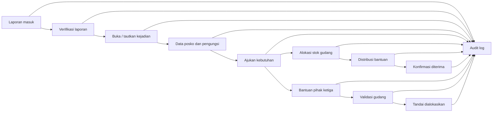

# Dokumentasi Database SiagaKita

Tanggal pembaruan: 9 Agustus 2026
Status: production-lite tahap awal, Supabase hosted free tier

Dokumen ini menjadi lampiran teknis database SiagaKita. Isinya menjelaskan struktur data, hak akses, alur mutasi, dan batas keamanan yang dipakai pada aplikasi. Dokumen ini tidak menyertakan API key, password, atau nilai rahasia dari `.env.local`.

## 1. Ringkasan

SiagaKita menggunakan Supabase PostgreSQL sebagai database utama untuk menyimpan data kejadian bencana, laporan lapangan, posko, kebutuhan pengungsi, stok logistik, distribusi bantuan, rekomendasi berbasis aturan, dan audit perubahan.

Project Supabase:

- Nama project: `siagakita-kmipn`
- Project ref: `ettucjesbqqihnzldzvu`
- URL: `https://ettucjesbqqihnzldzvu.supabase.co`
- Mode kerja: hosted Supabase, bukan local Docker untuk tahap ini
- Data seed: skenario pengembangan Sumatera Barat, bukan data kejadian aktual

## 2. Prinsip Desain Database

- Auth nyata menggunakan Supabase Auth email/password.
- Role aplikasi tidak diambil dari input user bebas atau `user_metadata`.
- Hak akses operasional dibaca dari `profiles` dan relasi lembaga.
- Semua tabel operasional mengaktifkan Row Level Security (RLS).
- Data publik hanya dibuka melalui view aman, bukan tabel mentah.
- Mutasi penting harus menulis `audit_logs`.
- Alokasi stok memakai RPC atomik agar stok tidak teralokasi melebihi jumlah tersedia.
- SMS Zero-Grid belum terhubung gateway; input SMS diperlakukan sebagai adapter manual yang tetap masuk antrean verifikasi.
- Rekomendasi operasional masih rule-based decision support dari data posko, stok, kebutuhan, kelompok rentan, dan akses lokasi. AI eksternal belum menjadi dasar keputusan operasional.

## 3. Role Aplikasi

Enum `app_role`:

| Role | Fungsi |
| --- | --- |
| `admin` | Mengelola seluruh data dan konfigurasi awal. |
| `bpbd_operator` | Mengelola kejadian, laporan, posko, kebutuhan, dan koordinasi tingkat BPBD. |
| `field_officer` | Membuat laporan lapangan dan membantu verifikasi. |
| `shelter_manager` | Mengelola data posko, populasi pengungsi, dan kebutuhan posko yang ditugaskan. |
| `warehouse_manager` | Mengelola stok gudang, alokasi, dan status distribusi yang ditugaskan. |
| `public_viewer` | Akses baca data publik aman. |

## 4. Enum Operasional

| Enum | Nilai |
| --- | --- |
| `crisis_status` | `critical`, `major`, `warning`, `safe` |
| `event_state` | `draft`, `active`, `closed`, `rehabilitation` |
| `escalation_level` | `Kabupaten`, `Provinsi`, `Nasional` |
| `report_channel` | `Web`, `SMS Zero-Grid`, `Petugas` |
| `report_status` | `baru`, `diverifikasi`, `ditindaklanjuti` |
| `distribution_status` | `disiapkan`, `dalam-perjalanan`, `diterima` |
| `warehouse_level` | `Posko`, `Kabupaten`, `Provinsi`, `Nasional` |
| `aid_status` | `menunggu-pencocokan`, `diterima-gudang`, `dialokasikan` |

## 5. Tabel Inti

### Auth dan Organisasi

| Tabel | Fungsi |
| --- | --- |
| `profiles` | Profil aplikasi yang terhubung ke `auth.users`, termasuk nama, email, dan role. |
| `institutions` | Data lembaga seperti BPBD, posko, gudang, atau mitra operasional. |
| `user_institutions` | Relasi user dengan lembaga untuk membatasi cakupan akses. |

### Kejadian Bencana

| Tabel | Fungsi |
| --- | --- |
| `disaster_events` | Data utama kejadian: nama, lokasi, status, level eskalasi, koordinat, dan ringkasan. |
| `event_status_history` | Riwayat perubahan status atau eskalasi kejadian. |

### Posko, Pengungsi, dan Kebutuhan

| Tabel | Fungsi |
| --- | --- |
| `shelters` | Data posko, lokasi, kapasitas, jumlah pengungsi, dan status operasional. |
| `shelter_population_updates` | Histori pembaruan jumlah pengungsi dan kelompok rentan secara agregat. |
| `needs` | Permintaan kebutuhan posko seperti makanan, air, selimut, obat, dan kebutuhan prioritas lain. |

### Gudang dan Logistik

| Tabel | Fungsi |
| --- | --- |
| `warehouses` | Data gudang berjenjang: posko, kabupaten, provinsi, nasional. |
| `inventory_items` | Item stok per gudang, satuan, jumlah tersedia, dan batas minimum. |
| `stock_movements` | Mutasi stok masuk, keluar, atau alokasi. |
| `distributions` | Pengiriman bantuan ke posko atau lokasi terdampak. |
| `distribution_items` | Detail item dan jumlah dalam satu distribusi. |
| `third_party_aids` | Bantuan dari pihak ketiga seperti NGO, perusahaan, komunitas, atau individu. Alurnya mencakup catat bantuan, validasi/cocokkan gudang, dan tandai dialokasikan. |

### Laporan dan Verifikasi

| Tabel | Fungsi |
| --- | --- |
| `field_reports` | Laporan masyarakat, petugas, atau SMS Zero-Grid manual/stub. |
| `report_verifications` | Catatan verifikasi laporan, status, catatan petugas, dan relasi ke kejadian bila dibuka. |

### Decision Support dan Audit

| Tabel | Fungsi |
| --- | --- |
| `ai_recommendations` | Rekomendasi rule-based berdasarkan kebutuhan, stok, kelompok rentan, dan akses lokasi. |
| `audit_logs` | Jejak audit setiap mutasi penting: actor, aksi, target tabel, target id, before/after, dan timestamp. |

## 6. View Publik Aman

SiagaKita memisahkan data operasional internal dan data publik. Halaman `/peta-publik` hanya memakai view aman berikut:

| View | Isi |
| --- | --- |
| `public_event_summary` | Ringkasan kejadian publik: nama, status umum, wilayah, koordinat kasar, dan informasi aman. |
| `public_shelter_summary` | Ringkasan posko publik: nama posko, wilayah, status buka/tutup, dan informasi bantuan umum. |

Data yang tidak boleh muncul di view publik:

- Nama korban atau data pribadi.
- Rincian kelompok rentan yang terlalu spesifik.
- Detail stok gudang internal.
- Rute distribusi internal.
- Audit log dan catatan verifikasi internal.
- Informasi lembaga atau user yang tidak perlu diketahui publik.

## 7. RPC Alokasi Stok Atomik

RPC utama:

```sql
allocate_distribution_atomic(
  p_inventory_item_id uuid,
  p_shelter_code text,
  p_quantity integer,
  p_eta text,
  p_priority crisis_status,
  p_notes text
)
```

Fungsi:

- Mengecek user login dan role dari `profiles`.
- Memastikan stok tersedia cukup.
- Mengurangi stok secara atomik.
- Membuat record `distributions`.
- Membuat record `distribution_items`.
- Membuat record `stock_movements`.
- Menulis `audit_logs`.
- Mengembalikan distribusi dan stok terbaru.

Keamanan RPC:

- Akses `anon` dicabut.
- Akses hanya untuk `authenticated`.
- Fungsi memakai guard internal berbasis `auth.uid()` dan role `profiles`.
- Karena menggunakan `SECURITY DEFINER`, Supabase Advisor dapat memberi peringatan residual. Untuk production-lite, risiko ini diterima dengan pembatasan role dan revoke execute dari `anon`. Untuk production penuh, fungsi dapat dipindahkan ke jalur private API/service role atau diperketat lagi dengan pola transaksi server-side.

## 8. Row Level Security (RLS)

Kebijakan RLS mengikuti prinsip berikut:

- User tidak login tidak boleh membaca halaman console atau tabel operasional.
- Public hanya boleh membaca view publik aman.
- `bpbd_operator` dapat membaca dan mengelola data operasional sesuai cakupan lembaga.
- `field_officer` dapat membuat laporan dan membantu verifikasi sesuai tugas.
- `shelter_manager` hanya mengelola posko dan kebutuhan yang ditugaskan.
- `warehouse_manager` hanya mengelola gudang, stok, dan distribusi yang ditugaskan.
- `admin` memiliki akses pengelolaan penuh untuk kebutuhan konfigurasi dan audit.

Catatan penting:

- Jangan memakai `user_metadata` untuk authorization karena bisa diubah dari sisi client.
- Pastikan policy `SELECT` ada untuk data yang perlu dikembalikan setelah `INSERT` atau `UPDATE`, agar mutasi tidak terlihat gagal diam-diam.
- View publik harus diperlakukan sebagai kontrak data publik, bukan shortcut untuk membuka tabel internal.

## 9. Alur Data Utama



## 10. Migration

| File | Tujuan |
| --- | --- |
| `20260730000100_siagakita_core.sql` | Skema inti, enum, tabel utama, RLS awal, view publik, dan seed dasar. |
| `20260809065623_siagakita_hardening_final_ready.sql` | Hardening untuk alur final-ready: audit, role, repository, dan kebijakan tambahan. |
| `20260809083000_siagakita_advisor_hardening_indexes.sql` | Penyesuaian index dan hardening berdasarkan advisor/performance awal. |
| `20260809090424_production_lite_atomic_distribution.sql` | RPC alokasi stok atomik untuk mencegah over-allocation. |
| `20260809091245_restrict_atomic_distribution_rpc.sql` | Pembatasan akses RPC agar tidak bisa dieksekusi role anonim. |
| `20260809100050_harden_public_safe_views_and_base_table_rls.sql` | Hardening akses publik agar peta publik memakai view aman, bukan tabel dasar mentah. |
| `20260809100423_use_security_invoker_public_views_with_safe_column_grants.sql` | Menyesuaikan view publik ke `security_invoker=true` dan membatasi grant anonim hanya pada kolom publik aman. |

## 11. Data Seed Pengembangan

Data seed dipakai untuk skenario demonstrasi dan pengujian internal:

- Fokus skenario: bencana di Sumatera Barat.
- Data tidak boleh diklaim sebagai data resmi pemerintah atau kejadian aktual.
- Data publik saat verifikasi terakhir berisi 3 ringkasan kejadian dan 3 ringkasan posko.
- Akun Auth untuk uji login perlu dibuat atau diverifikasi melalui Supabase Dashboard Authentication, lalu dipetakan ke `profiles`.

## 12. Status Verifikasi Terakhir

Pemeriksaan aplikasi:

- `pnpm lint`: lulus
- `pnpm exec tsc --noEmit`: lulus
- `pnpm build`: lulus

Pemeriksaan database hosted:

- `public_event_summary`: 3 record
- `public_shelter_summary`: 3 record
- `anon` tidak bisa execute `allocate_distribution_atomic`
- `authenticated` bisa execute `allocate_distribution_atomic`

Catatan advisor yang masih perlu ditangani sebelum production penuh:

- Leaked password protection perlu diaktifkan dari Supabase Auth settings.
- Beberapa index terbaca belum digunakan karena database masih fresh/traffic rendah.
- Beberapa policy RLS masih bisa disederhanakan untuk mengurangi multiple permissive policies.
- RPC `SECURITY DEFINER` masih perlu audit berkala jika cakupan user makin luas.

## 13. Batas Production-Lite

Tahap ini realistis untuk penggunaan terbatas dan demo final, tetapi belum setara production enterprise.

Yang sudah siap:

- Auth dan role berbasis database.
- Data operasional tersimpan.
- Public map aman melalui view.
- Audit log untuk mutasi penting.
- Halaman `/audit-log` untuk melihat riwayat keputusan dan perubahan penting oleh admin/operator BPBD.
- Workflow bantuan pihak ketiga: catat, validasi ke gudang, dan tandai dialokasikan.
- RPC atomik untuk alokasi stok.
- UI menghindari aksi palsu dan label prototype.

Yang belum terhubung:

- SMS gateway sungguhan; saat ini masih adapter manual yang mencatat format SMS ke `field_reports`.
- AI API eksternal sebagai dasar rekomendasi; saat ini rekomendasi masih rule-based dan harus ditinjau petugas.
- Monitoring berbayar.
- Backup dan disaster recovery enterprise.
- Integrasi data resmi pemerintah.

## 14. Command Pemeriksaan

```bash
npx -y pnpm@11.0.0 lint
npx -y pnpm@11.0.0 exec tsc --noEmit
npx -y pnpm@11.0.0 build
npx supabase migration list
```

Untuk hosted Supabase, migration dan query harus dijalankan memakai project yang benar: `ettucjesbqqihnzldzvu`.
